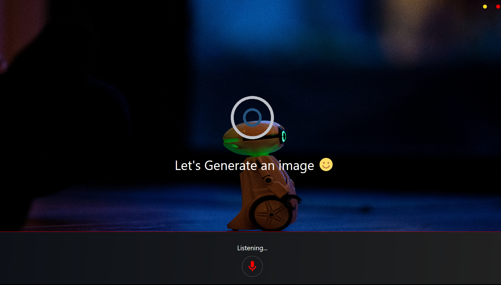
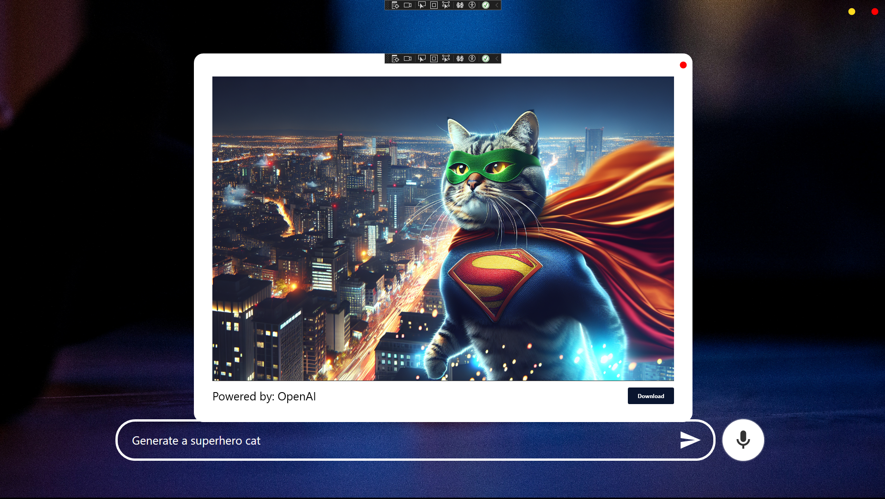
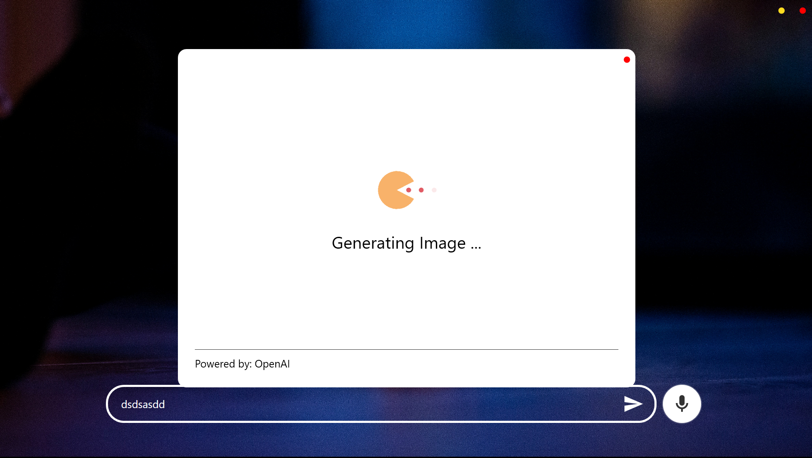

## 🎞️ WPF Generative AI Desktop Application

## About 

The application generates AI Image from user prompts using OpenAI's Dall-E-2 model

## Prerequisites / how to run

## Get your OpenAI API KEY/TOKEN from [here](https://platform.openai.com/docs/overview)

## Place the OpenAI API KEY/TOKEN in the project's .env file with "API_KEY" as it's key.

## Use Visual studio execute the solution GenAI_ImageGenerator.csproj

## Update any necessary dependencies using Visual Studio's ***Nuget Package Manager or Package Manager Console

## List all packages/dependencies 

```bash
  Install-Package <PackageName> [-Version <version>] [-ProjectName <project>] [-Source <source>] [-DependencyVersion <dependency>]
```

## Install package

```bash
  Install-Package <PackageName> [-Version <version>] [-ProjectName <project>] [-Source <source>] [-DependencyVersion <dependency>]
```

## Technologies/Dependencies used

<div id="badges">
  
  
  
  
  
  
  
  
</div>

## User Interface

### Main window 


### Speech to text



### Generated Image Dialog




## Version 
1.0.0

## Licenced 
Under [`MIT`](LICENSE) - Copyright 2025  

