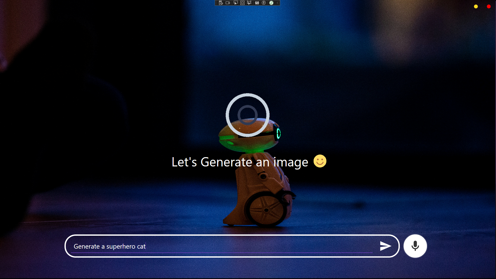

🤖 WPF Generative AI Desktop Application

## About application

The application generates AI Images from user prompts using OpenAI's Dall-E-3 model.
The application also supports a speech-to-text cognitive service using System.Speech.Recognition library.

## Prerequisites / how to run

- Get your OpenAI API KEY/TOKEN from [here](https://platform.openai.com/docs/overview)

- Set your API_KEY. Note: This should only be used in development. For production, consider using safer methods of retrieving your API KEY.

```bash
  private string API_KEY = "YOUR_API_KEY"
```

- Use Visual studio to execute the solution GenAI_ImageGenerator.csproj

### List all packages/dependencies 

```bash
  Install-Package <PackageName> [-Version <version>] [-ProjectName <project>] [-Source <source>] [-DependencyVersion <dependency>]
```

## Install a package

```bash
  Install-Package <PackageName> [-Version <version>] [-ProjectName <project>] [-Source <source>] [-DependencyVersion <dependency>]
```

## Technologies/Dependencies used

<div id="badges">
  
  
  
  
  
  
  
  
</div>

## User Interface

### Main window 


### Generated Image Dialog


### Speech to text


## Version 
1.0.0

## Licenced 
Under [`MIT`](LICENSE) - Copyright 2025  

